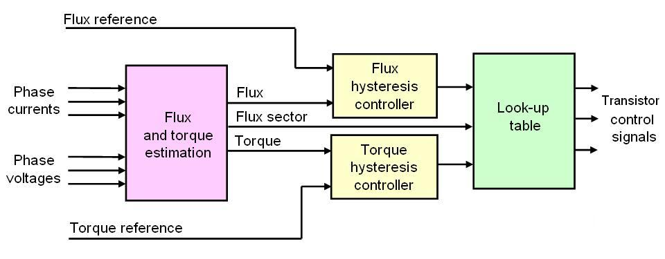

# Tracking mount experiments

## Setup

For PyCharm:
* Add the parent folder of CIRCUITPY device as a project root
* `sudo apt install tio`
* `conda env create -f environment.yml -p ./.env`
* Set PyCharm's interpreter to conda env at `./.env`
* For terminal: `tio /dev/ttyACM0`

[More info](https://learn.adafruit.com/welcome-to-circuitpython/pycharm-and-circuitpython)

https://github.com/byDagor/Janus-Controller/blob/master/Images/JC20.01-Features.PNG